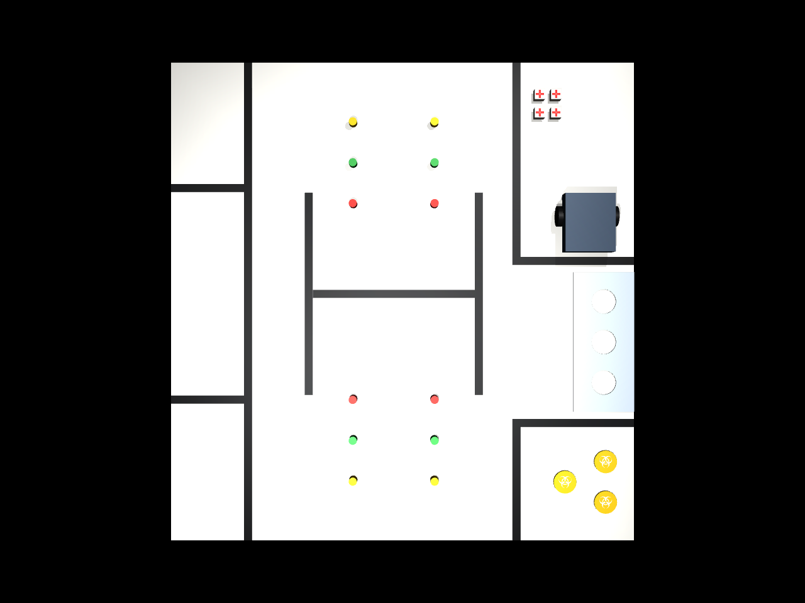
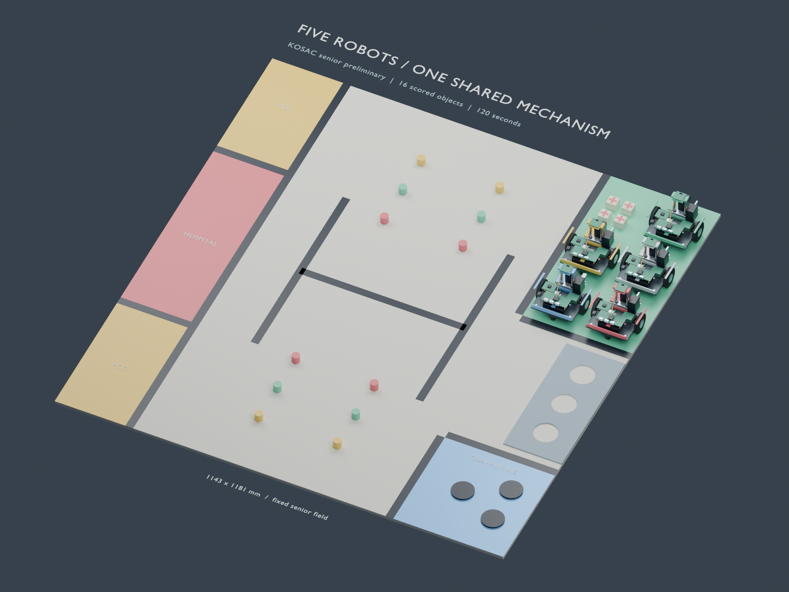
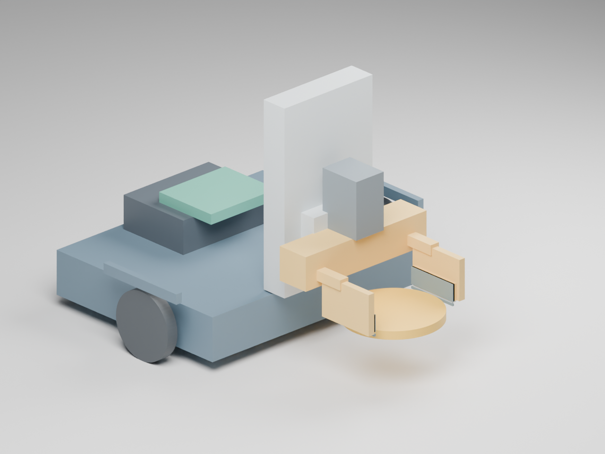
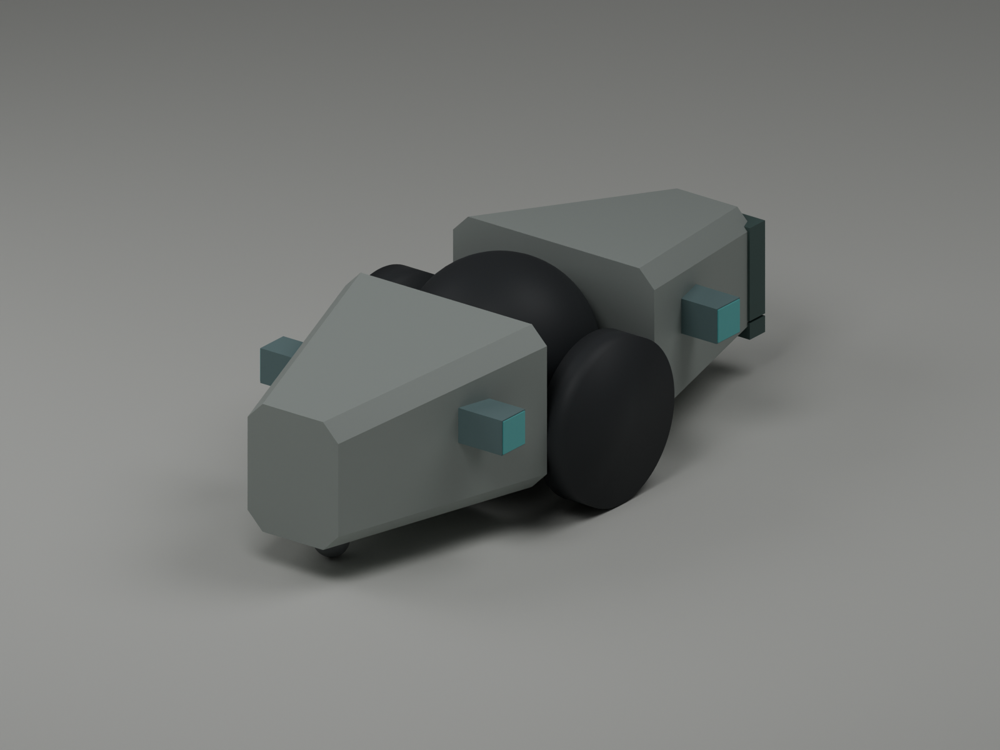

# 2026 로보틱스 챌린지 경기장

2026 로보틱스 챌린지 문제해결 트랙의 경기장을 Blender로 재현했습니다. MuJoCo 실행 환경, Blender 편집 파일, 기존 USD 파일, 미리보기와 치수 검증 자료를 제공합니다.

경기장 크기는 가로 1,143 mm × 세로 1,181 mm입니다. 검은 경계선은 폭 20 mm, 두께 0.15 mm의 테이프로 구현했습니다.


## MuJoCo 실행

실제 물리 실행과 강화학습은 MuJoCo 3.12.0을 사용합니다. 테이프는 두께 0.15 mm의 변형 가능한 PVC 셸과 아래쪽 접착 접촉으로 구성했습니다. 종이·PVC·나무·바퀴의 마찰, 네 벽의 마찰, 모터 한계와 명령 지연을 따로 설정할 수 있습니다.

```sh
python3 -m venv .venv
.venv/bin/python -m pip install -r requirements-mujoco.txt
.venv/bin/python -m arena_mujoco run --seconds 0.1
```

설치 후 Linux에서는 `.venv/bin/python -m arena_mujoco view`, macOS에서는 `.venv/bin/mjpython -m arena_mujoco view`로 경기장을 엽니다. [실행·Gymnasium 안내](docs/mujoco.md), [실물 측정과 보정](docs/mujoco_calibration.md), [Colab 실행 기록](docs/colab_runtime.md)을 확인할 수 있습니다. 기본 물성은 실측 전 초기값이며, 예제 로봇은 질량 1 kg의 차동 구동형입니다.



## 시니어 예선 5대 분업 설계

LAB, RED, YELLOW, KIT, GREEN이 16개 운반 과제를 나눠 수행합니다. 125 × 150 mm 로봇 5대를 출발 구역에 배치하고, KIT에 의료 키트 4개를 미리 싣습니다. LAB은 수평 확장 집게, 전방 보조 캐스터와 이동식 검사 카메라를 사용합니다. 최종 형상의 기본 물성 실행은 79.60초에 160점을 얻고 이후 5초 동안 점수를 유지했습니다.



```sh
.venv/bin/python -m pip install -r requirements-best-design.txt
.venv/bin/python scripts/run_best_fleet.py --drive-limits .48 4 \
  --lab-drive-limits .35 2.5 --green-upper-first \
  --output output/best_design/reproduction
```

G4에서 학습한 CNN은 독립 시험 영상 3,000장의 99.70%를 분류했습니다. 주행 정책은 시간 벌점을 초당 0.05에서 0.5로 높였으며, 독립 시험 목표 120개 중 119개에 도달했습니다. 전체 과제 실행에는 시뮬레이터 위치를 관측하는 기하 제어기를 사용합니다. RGB 기반 전체 과제 수행과 실물 성능은 별도로 검증해야 합니다.

[구조와 운반 계획](docs/best_design_mechanics.md), [G4 학습·시간 비교](docs/best_design_training.md), [검사 카메라 검증](docs/best_onboard_sample_camera.md), [Blender 편집 파일](output/best_design/best_design.blend), [최종 시뮬레이션 영상](output/best_design/final_frame_160_top.mp4)을 제공합니다.

## 시니어 예선 단일 로봇과 학습 정책

폭 180 × 길이 200 mm, 질량 800 g의 4모터 로봇을 설계했습니다. 높이가 다른 집게 접촉면으로 원기둥, 의료 키트, 얇은 샘플 원판을 잡습니다. A100에서 학습한 신경망이 주행·회전·리프트·집게 속도를 제어합니다.

검증 실행은 16개 운반 과제를 완료해 160/160점을 얻었고, 최종 배치를 5초간 유지했습니다. 완료 시간은 시뮬레이션 기준 738.76초로 공식 120초 제한을 넘었으며, 이번 결과는 예선 과제 수행 가능성을 확인한 기록입니다. A100 학습에는 12.84초가 걸렸습니다.



```sh
.venv/bin/python scripts/run_competition.py --output output/competition/reproduction
.venv/bin/python scripts/verify_competition_proof.py output/competition/reproduction
```

[과제 검증과 재현 방법](docs/competition_proof.md), [로봇 설계와 부품](docs/robot_design.md), [예선 규칙 검토](docs/competition_tasks.md), [A100 학습 기록](docs/colab_training.md)을 제공합니다. 전체 과제 검증은 시뮬레이터 상태 관측과 강체 테이프 설정을 사용하며, 완료 시간과 공식 120초 제한을 별도로 기록합니다.

## 자석으로 연결되는 소형 로봇 40대

폭 24 × 길이 55 mm, 질량 40 g의 모듈 40대를 설계했습니다. 두 바퀴와 8 mm 리프트를 각각 구동하며, 측면의 전자영구자석 연결부 네 개로 이웃 모듈과 붙거나 분리됩니다. 40대 모두 280 × 480 mm 출발 구역 안에서 출발합니다. 로봇 사이의 충돌, 마찰, 제한된 자력으로 연결을 유지하며 움직입니다.

연결된 군집에서 로봇 네 대가 분리되어 원기둥과 의료 키트를 들어 운반한 뒤 다시 합류하는 과제입니다. 공유 신경망은 주변 로봇과 연결 상태를 관측하고 각 모듈의 두 바퀴, 리프트, 자석을 제어합니다. 학습은 물리 시연, DAgger, MAPPO를 사용합니다. 현재 물리 시연에서 두 물체의 운반과 내려놓기를 확인했으며, 군집의 연결 유지와 재합류를 검증하고 있습니다. 군집 정책의 GPU 학습 결과와 최종 영상은 준비 중입니다.



[모듈 설계와 접촉 시험](docs/swarm_robot_design.md), [학습 방법과 실행 명령](docs/swarm_learning.md), [Blender·STL 설계 자료](output/swarm/body_robot/README.md)를 제공합니다. 과제는 경기장의 물체 형상을 사용하며 출발, 운반, 분리, 재연결을 검증합니다. 공식 경기 점수는 계산하지 않습니다. 이전의 독립 운반 쌍 실험은 [별도 기록](docs/swarm_transport_baseline.md)에 보관했습니다.

## 다운로드

**[경기장 릴리스 ZIP 다운로드](https://github.com/ghandhitechnology/robotics-challenge-arena/releases/latest/download/robotics_challenge_arena.zip)**

1. 위 링크에서 `robotics_challenge_arena.zip`을 내려받습니다.
2. ZIP 파일의 압축을 풉니다.
3. 압축을 푼 폴더 안의 `robotics_challenge_arena/output/`에서 아래 표에 맞는 파일을 엽니다.

[릴리스 페이지](https://github.com/ghandhitechnology/robotics-challenge-arena/releases/latest)에서도 같은 경기장 ZIP과 다운로드 검증용 체크섬을 받을 수 있습니다. 현재 브랜치의 로봇·정책·검증 자료는 저장소 상단의 **Code → Download ZIP**으로 받습니다. 압축을 푼 저장소의 `output/competition/` 폴더에 들어 있습니다.

### 어떤 파일을 열어야 하나요?

| 사용 목적 | MuJoCo MJCF | Blender에서 열 파일 | 기존 Isaac Sim 파일 |
| --- | --- | --- | --- |
| 국내 시니어 예선 연습 및 강화학습 | `mujoco/senior_preliminary.xml` | `challenge_arena_senior.blend` | `challenge_arena_senior_scene.usda` |
| 제공된 사진과 같은 블록 배치, 울타리 없음 | `mujoco/photo_reference.xml` | `challenge_arena.blend` | `challenge_arena_scene.usda` |
| 제공된 사진과 같은 블록 배치, 나무 울타리 포함 | `mujoco/framed_reference.xml` | `challenge_arena_framed.blend` | `challenge_arena_framed_scene.usda` |

국내 시니어 예선을 준비한다면 `senior` 파일을 사용합니다. 사진 배치와 시니어 예선 배치는 키트 수와 차단 빔 유무가 다릅니다.

| 구성 | 색상 원기둥 | 의료 키트 | 샘플 원판 | 차단 빔 | 울타리 |
| --- | --- | --- | --- | --- | --- |
| 시니어 예선 | 12개 | 4개 | 3개 | 없음 | 없음 |
| 사진 배치 | 12개 | 10개 | 3개 | 2개 | 없음 |
| 울타리 포함 사진 배치 | 12개 | 10개 | 3개 | 2개 | 있음 |

### Blender에서 열기

Blender를 실행한 뒤 **File → Open**에서 원하는 `.blend` 파일을 선택합니다. Blender 5.2.1에서 제작하고 검증했습니다. 각 블록, 테이프, 실험실 판과 문양은 개별 메시로 편집할 수 있으며 외부 텍스처 파일은 필요하지 않습니다.

### Isaac Sim에서 열기

Isaac Sim의 **File → Open**에서 원하는 `_scene.usda` 파일을 선택합니다. 이 파일에는 경기장 참조, 물리 장면과 조명이 들어 있습니다. 같은 이름의 `.usdc` 파일을 반드시 같은 폴더에 두어야 합니다. 예를 들어 `challenge_arena_senior_scene.usda`와 `challenge_arena_senior.usdc`는 함께 보관합니다.

기존 Isaac Lab 강화학습 환경에 경기장만 추가하려면 `.usdc` 파일의 `/Arena` 프림을 참조합니다. 좌표 단위는 미터, 위쪽 축은 Z입니다. 이동 가능한 블록에는 강체와 충돌 형상을 설정했으며, 바닥·테이프·실험실 판에는 정적 충돌 형상을 설정했습니다. 물리 장면 구성과 실행 확인 방법은 [Isaac Sim 안내](docs/isaac_sim.md)에 정리했습니다.

## 주요 치수

아래 치수의 단위는 mm입니다. 원점은 사진 기준 경기장 왼쪽 아래 모서리입니다. X는 오른쪽, Y는 사진 위쪽, Z는 높이 방향이며 바닥 윗면은 Z=0입니다.

| 요소 | 치수 |
| --- | --- |
| 경기장 | 가로 1,143 × 세로 1,181 |
| 검은 테이프 | 폭 20 × 두께 0.15 |
| 왼쪽 의료 구역, 아래부터 | 180 × 338 / 180 × 503 / 180 × 300 |
| 출발·회복 구역 내부 | 280 × 480 |
| 격리 구역 내부 | 280 × 280 |
| 중앙 H자 테이프 | 세로 막대 길이 500, 막대 사이 안쪽 간격 400 |
| 색상 원기둥 | 지름 20 × 높이 20 |
| 의료 키트 | 가로 25 × 세로 25 × 높이 20 |
| 의료 키트 십자 문양 | 전체 20 × 20, 선 폭 5 |
| 샘플 원판 | 지름 56 × 두께 5 |
| 실험실 판 | 가로 150 × 세로 345 × 두께 3, 지름 60의 구멍 3개 |
| 차단 빔 | 폭 60 × 길이 280 또는 250 × 높이 20 |
| 선택형 나무 울타리 | 두께 20 × 높이 65 |

실험실 구멍의 중심 간격 100 mm와 일부 물체의 초기 위치는 도면 비율로 정했습니다. 실험실 판은 양쪽 테이프에서 각각 18 mm 떨어져 있습니다. 왼쪽 아래 의료 구역의 길이 338 mm는 전체 길이와 나머지 표기 치수에서 계산한 값입니다. 치수와 배치는 `arena_spec.json`에서 조정합니다. MuJoCo 물성은 별도의 JSON 프로필로 덮어쓸 수 있습니다.

## 치수 근거와 검증

국내 안내문의 치수를 우선 적용하고, 누락된 중앙 테이프·원기둥 배치·구멍·차단 빔 치수는 공식 국제 룰북에서 확인했습니다. 실험실 판 길이는 국내 안내문의 345 mm를 적용했습니다. 출처별 치수와 해석은 [국내 안내문 검토](reference/full_document_audit.md)와 [국제 룰북 검토](reference/international_dimension_audit.md)에 기록했습니다. 원본 문서는 `reference/` 폴더에 포함되어 있습니다.

Blender 메시와 USD 내보내기 결과는 1,055개 검사 항목을 통과했습니다. 테이프 폭과 두께, 블록 크기, 구멍 관통 여부, 초기 겹침, 장면별 물체 수와 충돌 설정을 확인했습니다. Isaac Sim에서의 실제 물리 실행은 NVIDIA GPU 환경에서 추가로 확인해야 합니다.

- [검증 결과](output/verification.md)
- [물체별 치수 측정 CSV](output/dimension_measurements.csv)
- [사진과 Blender 비교 이미지](output/reference_comparison.png)
- [물체 목록과 구역 경계](output/arena_manifest.json)

## 파일 구성

| 경로 | 내용 |
| --- | --- |
| `output/` | Blender·USD 파일, 미리보기, 검증 결과와 전체 ZIP |
| `arena_spec.json` | 치수, 배치 좌표, 물리 설정과 출처 |
| `scripts/` | 경기장 생성, 검증, 보정, 렌더링과 압축 스크립트 |
| `arena_mujoco/` | MuJoCo 모델 생성, 재질, 테이프 접착 이력, 로봇과 Gym 환경 |
| `profiles/` | 실물 측정 입력 예시와 물성 프로필 |
| `reference/` | 원본 PDF, 배치 사진과 치수 검토 자료 |
| `docs/` | 형상 검토와 Isaac Sim 사용 안내 |

## 직접 생성하기

저장소를 복제한 후 Blender 실행 파일이 명령 경로에 있는 환경에서 아래 명령을 실행합니다.

```sh
git clone https://github.com/ghandhitechnology/robotics-challenge-arena.git
cd robotics-challenge-arena
blender --background --factory-startup --python-exit-code 1 --python scripts/build_arena.py
blender --background --factory-startup --python-exit-code 1 --python scripts/validate_arena.py
```

macOS에서 `blender` 명령을 찾지 못한다면 `/Applications/Blender.app/Contents/MacOS/Blender`로 바꿔 실행합니다. 저장된 장면의 미리보기만 다시 만들려면 `scripts/render_previews.py`를 사용합니다.

사진 비교 이미지 생성에는 별도 Python 패키지가 필요합니다.

```sh
python3 -m venv .venv
.venv/bin/pip install -r requirements-qa.txt
.venv/bin/python scripts/compare_reference.py
python3 scripts/package_arena.py
```
