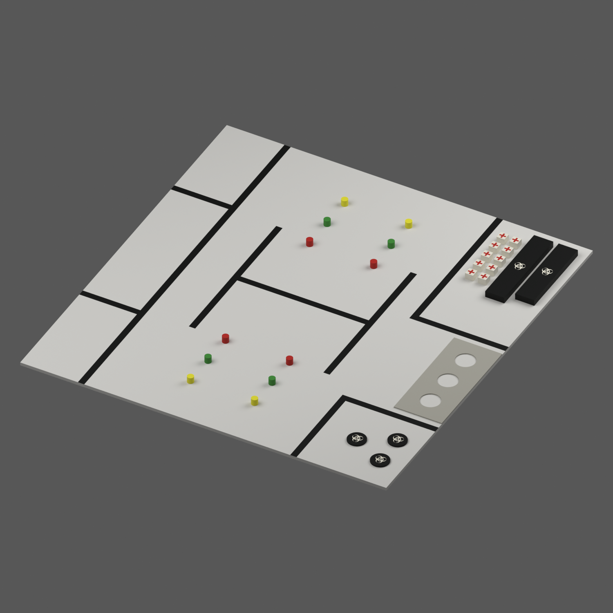

# 2026 로보틱스 챌린지 경기장

2026 로보틱스 챌린지 문제해결 트랙의 경기장을 Blender로 재현했습니다. Blender 편집 파일, Isaac Sim용 USD 파일, 미리보기 이미지, 생성 스크립트와 치수 검증 자료를 제공합니다.

경기장 크기는 가로 1,143 mm × 세로 1,181 mm입니다. 검은 경계선은 폭 20 mm, 두께 0.15 mm의 테이프로 구현했습니다.



## 다운로드

**[전체 파일 ZIP 다운로드](https://github.com/ghandhitechnology/robotics-challenge-arena/releases/latest/download/robotics_challenge_arena.zip)**

1. 위 링크에서 `robotics_challenge_arena.zip`을 내려받습니다.
2. ZIP 파일의 압축을 풉니다.
3. 압축을 푼 폴더 안의 `robotics_challenge_arena/output/`에서 아래 표에 맞는 파일을 엽니다.

[릴리스 페이지](https://github.com/ghandhitechnology/robotics-challenge-arena/releases/latest)에서도 같은 ZIP과 다운로드 검증용 체크섬을 받을 수 있습니다. 저장소 상단의 **Code → Download ZIP**으로 내려받은 경우에는 압축을 푼 저장소의 `output/` 폴더를 사용합니다.

### 어떤 파일을 열어야 하나요?

| 사용 목적 | Blender에서 열 파일 | Isaac Sim에서 열 파일 |
| --- | --- | --- |
| 국내 시니어 예선 연습 및 강화학습 | `challenge_arena_senior.blend` | `challenge_arena_senior_scene.usda` |
| 제공된 사진과 같은 블록 배치, 울타리 없음 | `challenge_arena.blend` | `challenge_arena_scene.usda` |
| 제공된 사진과 같은 블록 배치, 나무 울타리 포함 | `challenge_arena_framed.blend` | `challenge_arena_framed_scene.usda` |

국내 시니어 예선을 준비한다면 `senior` 파일을 사용합니다. 사진 배치와 시니어 예선 배치는 키트 수와 차단 빔 유무가 다릅니다.

| 구성 | 색상 원기둥 | 의료 키트 | 샘플 원판 | 차단 빔 | 울타리 |
| --- | --- | --- | --- | --- | --- |
| 시니어 예선 | 12개 | 4개 | 3개 | 없음 | 없음 |
| 사진 배치 | 12개 | 10개 | 3개 | 2개 | 없음 |
| 울타리 포함 사진 배치 | 12개 | 10개 | 3개 | 2개 | 있음 |

### Blender에서 열기

Blender를 실행한 뒤 **File → Open**에서 원하는 `.blend` 파일을 선택합니다. Blender 5.2.1에서 제작하고 검증했습니다. 각 블록, 테이프, 실험실 판과 문양은 개별 메시로 편집할 수 있으며 외부 텍스처 파일은 필요하지 않습니다.

### Isaac Sim에서 열기

Isaac Sim의 **File → Open**에서 원하는 `_scene.usda` 파일을 선택합니다. 이 파일에는 경기장 참조, 물리 장면과 조명이 들어 있습니다. 같은 이름의 `.usdc` 파일을 반드시 같은 폴더에 두어야 합니다. 예를 들어 `challenge_arena_senior_scene.usda`와 `challenge_arena_senior.usdc`는 함께 보관합니다.

기존 Isaac Lab 강화학습 환경에 경기장만 추가하려면 `.usdc` 파일의 `/Arena` 프림을 참조합니다. 좌표 단위는 미터, 위쪽 축은 Z입니다. 이동 가능한 블록에는 강체와 충돌 형상을 설정했으며, 바닥·테이프·실험실 판에는 정적 충돌 형상을 설정했습니다. 물리 장면 구성과 실행 확인 방법은 [Isaac Sim 안내](docs/isaac_sim.md)에 정리했습니다.

## 주요 치수

아래 치수의 단위는 mm입니다. 원점은 사진 기준 경기장 왼쪽 아래 모서리입니다. X는 오른쪽, Y는 사진 위쪽, Z는 높이 방향이며 바닥 윗면은 Z=0입니다.

| 요소 | 치수 |
| --- | --- |
| 경기장 | 가로 1,143 × 세로 1,181 |
| 검은 테이프 | 폭 20 × 두께 0.15 |
| 왼쪽 의료 구역, 아래부터 | 180 × 338 / 180 × 503 / 180 × 300 |
| 출발·회복 구역 내부 | 280 × 480 |
| 격리 구역 내부 | 280 × 280 |
| 중앙 H자 테이프 | 세로 막대 길이 500, 막대 사이 안쪽 간격 400 |
| 색상 원기둥 | 지름 20 × 높이 20 |
| 의료 키트 | 가로 25 × 세로 25 × 높이 20 |
| 의료 키트 십자 문양 | 전체 20 × 20, 선 폭 5 |
| 샘플 원판 | 지름 56 × 두께 5 |
| 실험실 판 | 가로 150 × 세로 345 × 두께 3, 지름 60의 구멍 3개 |
| 차단 빔 | 폭 60 × 길이 280 또는 250 × 높이 20 |
| 선택형 나무 울타리 | 두께 20 × 높이 65 |

실험실 구멍의 중심 간격 100 mm와 일부 물체의 초기 위치는 도면 비율로 정했습니다. 실험실 판은 양쪽 테이프에서 각각 18 mm 떨어져 있습니다. 왼쪽 아래 의료 구역의 길이 338 mm는 전체 길이와 나머지 표기 치수에서 계산한 값입니다. 나무 밀도, 마찰 계수와 바닥 아래 받침 두께는 `arena_spec.json`에서 조정할 수 있습니다.

## 치수 근거와 검증

국내 안내문의 치수를 우선 적용하고, 누락된 중앙 테이프·원기둥 배치·구멍·차단 빔 치수는 공식 국제 룰북에서 확인했습니다. 실험실 판 길이는 국내 안내문의 345 mm를 적용했습니다. 출처별 치수와 해석은 [국내 안내문 검토](reference/full_document_audit.md)와 [국제 룰북 검토](reference/international_dimension_audit.md)에 기록했습니다. 원본 문서는 `reference/` 폴더에 포함되어 있습니다.

Blender 메시와 USD 내보내기 결과는 1,055개 검사 항목을 통과했습니다. 테이프 폭과 두께, 블록 크기, 구멍 관통 여부, 초기 겹침, 장면별 물체 수와 충돌 설정을 확인했습니다. Isaac Sim에서의 실제 물리 실행은 NVIDIA GPU 환경에서 추가로 확인해야 합니다.

- [검증 결과](output/verification.md)
- [물체별 치수 측정 CSV](output/dimension_measurements.csv)
- [사진과 Blender 비교 이미지](output/reference_comparison.png)
- [물체 목록과 구역 경계](output/arena_manifest.json)

## 파일 구성

| 경로 | 내용 |
| --- | --- |
| `output/` | Blender·USD 파일, 미리보기, 검증 결과와 전체 ZIP |
| `arena_spec.json` | 치수, 배치 좌표, 물리 설정과 출처 |
| `scripts/` | 경기장 생성, 검증, 렌더링과 압축 스크립트 |
| `reference/` | 원본 PDF, 배치 사진과 치수 검토 자료 |
| `docs/` | 형상 검토와 Isaac Sim 사용 안내 |

## 직접 생성하기

저장소를 복제한 후 Blender 실행 파일이 명령 경로에 있는 환경에서 아래 명령을 실행합니다.

```sh
git clone https://github.com/ghandhitechnology/robotics-challenge-arena.git
cd robotics-challenge-arena
blender --background --factory-startup --python-exit-code 1 --python scripts/build_arena.py
blender --background --factory-startup --python-exit-code 1 --python scripts/validate_arena.py
```

macOS에서 `blender` 명령을 찾지 못한다면 `/Applications/Blender.app/Contents/MacOS/Blender`로 바꿔 실행합니다. 저장된 장면의 미리보기만 다시 만들려면 `scripts/render_previews.py`를 사용합니다.

사진 비교 이미지 생성에는 별도 Python 패키지가 필요합니다.

```sh
python3 -m venv .venv
.venv/bin/pip install -r requirements-qa.txt
.venv/bin/python scripts/compare_reference.py
python3 scripts/package_arena.py
```
