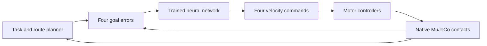

# Preliminary robot proof

This proof combines a compact four-motor robot, an A100-trained feedback network, and the senior preliminary arena. The target is all five task types and 160 task points. The mission collects the four kits from the reconstructed diagram positions, seats three samples in separate laboratory holes, and delivers three cylinders of each color to their required zones.

## Results

The native run completed all 16 deliveries and earned 160/160 task points. The independent artifact verifier recomputed the score and checked every recorded neural action. The robot finished after 738.76 simulated seconds, followed by a valid five-second final view. This is the requested preliminary task-feasibility proof; the official 120-second limit was exceeded.

| Measurement | Recorded result |
| --- | ---: |
| Kits / samples / red / yellow / green delivered | 4 / 3 / 3 / 3 / 3 |
| Task score | 160 / 160 |
| Completion time | 738.76 simulated seconds |
| Evaluation wall time, including final view | 381.25 seconds |
| Wheel-axle travel distance | 30.755 m |
| Maximum body tilt | 2.50° |
| Native numerical warnings / field exits | 0 / 0 |
| Verified neural calls | 37,188 |
| Largest recorded-versus-recomputed neural output error | 2.22 × 10⁻¹⁶ |
| A100 training / data preparation | 12.84 s / 1.35 s |
| Local NumPy inference, 20,000 calls | 3.00 µs per call |

The zero-output policy completed no deliveries and failed to leave the start. The trained weights, complete primary recording, and zero-policy comparison are saved under `output/competition/`. The inference benchmark records the local machine and measurement method.

A second run used seed 7, randomized material and motor parameters, and up to 1 mm of robot starting-position jitter. It also completed all 16 deliveries for 160/160 points and retained a valid five-second final view, with no numerical warnings or field exits. Completion took 731.44 simulated seconds and travel measured 30.708 m. Its full recording is in `output/competition/heldout/`.

The 44 native tests and four artifact-verifier tests passed. Their logs are in `output/competition/checks/`. The verifier tests reject altered source hashes, changed neural actions, forged completion, and an incomplete final view.

## Reproduce the run

Install the pinned native environment using the commands in the repository README, then run:

```sh
.venv/bin/python scripts/run_competition.py --output output/competition/reproduction
.venv/bin/python scripts/verify_competition_proof.py output/competition/reproduction
```

The CLI returns a failure code unless all 16 deliveries earn the full geometric score and remain valid through a five-second final view. The declaration timestamp precedes that view. Partial debugging is explicit through `--max-tasks`.

To repeat the physics variation used for a held-out trial:

```sh
.venv/bin/python scripts/run_competition.py --seed 7 --randomize --start-jitter-mm 1 --output output/competition/heldout
```

The saved neural weights run through NumPy without PyTorch or a GPU. The A100 is used for training. Training commands, exact source commits, hardware observations, checksums, and the baseline comparison are in [the training record](colab_training.md).

## What the network controls

A geometric planner selects objects, corridor waypoints, and pickup/drop poses. The network receives four normalized goal errors and emits forward speed, yaw rate, lift speed, and jaw speed. Encoder PI control follows the requested wheel speeds within the modeled motor torque-speed envelope. Force-limited lift and jaw servos integrate the learned velocity outputs with anti-windup.



Observations use exact simulator robot, object, and joint poses. The hardware design includes encoder and camera options; the proof does not implement onboard visual perception. This is supervised distillation of a feedback controller inside a hybrid planner. The network is active throughout pickup, transport, and release.

The network has 672 active parameters in a masked 4–48–48–4 architecture. Independent channels prevent yaw error from closing the jaws, and odd symmetry gives exactly zero output at zero error. One seeded GPU shuffle mixes near-goal and large-error examples. Frozen GPU-resident data, fused AdamW, TF32-enabled matrix multiplication, and a 4,044-byte weight export keep training and inference inexpensive.

## Physical model and scoring

The robot is 180 × 200 mm and 800 g. Two wheel motors, one rack lift, and one pinion driving opposing jaw racks provide all motion. The lower contact band grips the top edge of a 5 mm sample while clearing the 3 mm laboratory plate. Broad upper pads hold kits and cylinders. The rear caster and 100 mm axle-to-tool reach leave 5 mm wheel clearance at the lab edge. [The design record](robot_design.md) includes catalog parts, load estimates, construction dimensions, and Blender/STL references.

Task objects remain free rigid bodies throughout the mission. Grasping uses force-limited rubber/wood contacts. The robot's single joint equality couples the two jaws. The controller waits for the jaws to open before withdrawing, which prevents a seated sample being dragged against the hole edge.

The full mission uses native MuJoCo 3.12.0, a 1 ms physics step, 50 Hz learned control, and slip-dependent friction updates at 100 Hz. Tape has its specified 0.15 mm thickness and uses the rigid approximation for these runs. The existing deformable adhesive tape model remains available through the arena runtime. Material values are uncalibrated engineering priors; the randomized trial varies friction, density, and motor strength.

The competition model uses Newton with elliptic friction cones and an impedance ratio of 100. This reduces regularized friction creep without increasing the friction coefficient. Separate compliant pad-contact settings preserve the gripping insert behavior. The native long-hold coupon measured about 0.054 mm sample creep over 30 seconds. This solver choice follows [MuJoCo's grasping guidance](https://mujoco.readthedocs.io/en/latest/modeling.html#preventing-slip).

The scorer checks entire rotated object footprints, distinct sample holes, sample seating height, robot release contacts, object velocity, kit quotas, yellow distribution across both PCCs, and wrong-color contamination. Setup checks cover the complete robot envelope, nominal task-piece placement, and initial overlaps. Exit events are observed every 20 ms. [The rule audit](competition_tasks.md) identifies the supplied rules and reconstructed dimensions.

## Evidence files

| File | Evidence |
| --- | --- |
| `report.json` | Declaration score, full-run status, time, distance, event history, solver settings and source hashes. |
| `scene.xml`, `metadata.json` | The exact model, physical parameters, geometry and event ledger used by the run. |
| `trajectory.npz` | Recorded 10 Hz poses and phases, including the valid initial robot and object state. |
| `policy_trace.npz` | Every 50 Hz network observation/output, timestamp, channel name and physical scaling. |
| `declaration_state.npz`, `final_state.npz` | Positions, velocities, controls and time before and after the final view. |
| `verification.json` | Independent artifact checks, recomputed scores and replay of recorded neural outputs. |

The verifier checks source/model/weight hashes, the initial setup, the declaration and final geometry, all recorded neural actions, and every saved pose during the final view. Its report states that it checks recorded evidence; reproducing physics requires the mission command above.

## Render the attached video

```sh
.venv/bin/python scripts/render_competition_video.py --render
```

This renders the recorded native poses, then uses HyperFrames for the continuous field view and report panel. The simulation clock and task phase come from the recording. Playback runs at 3×, with no pose interpolation. The final 720p inline attachment is `videos/competition-proof/renders/competition-proof-pr.mp4`; the master is 1080p. The render manifest records the scene, trajectory, report and native-footage hashes. `output/competition/video/video-metadata.json` records the finished export checksums, and the same folder contains inspected frames.
