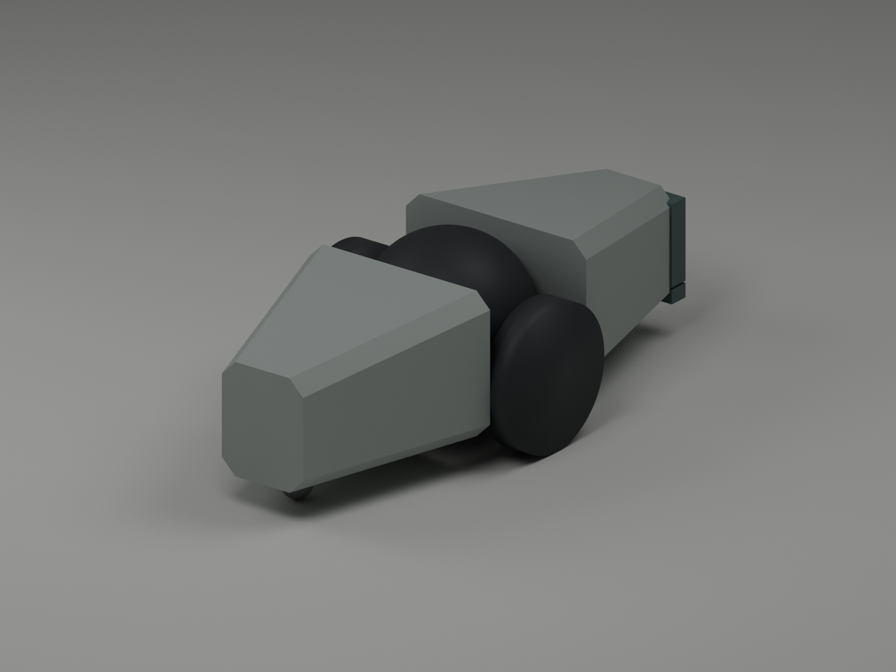

# Miniature swarm module

The module keeps the reference photograph's two tapered gray lobes and central dark ball. It adds two concealed drive wheels and a lifting rubber contact face at one tip. Forty identical modules can form opposing grasp teams around several objects. Each module has a free body and three motors.

The photograph shows the exterior only. Dimensions, mass, transmission layout, tire compound, sensors, and lifting mechanism below are engineering proposals. The native contact tests validate this simulated geometry and its chosen material coefficients. A fabricated prototype still needs packaging, traction, backlash, and battery measurements.



| Property | Proposed value |
| --- | --- |
| Ground footprint | 24 mm wide × 55 mm long |
| Local bounds | X −12…12 mm, Y −27…28 mm |
| Body reference height | 7 mm at level wheel contact |
| Height clearance budget | 23 mm including raised pad |
| Complete mass | 40 g including trim ballast |
| Drive | Two independent 14 × 3 mm tires, 21 mm track |
| Wheel command | −20…20 rad/s, approximately ±140 mm/s unloaded |
| Wheel torque limit | 2 mN m per wheel |
| Lift travel | 8 mm |
| Lift force and speed limits | 0.5 N, 10 mm/s |
| Low contact band | 3.4…4.8 mm above the floor at home |
| Upper contact band | 5…13 mm above the floor at home |
| Contact face | 10 mm wide, 28 mm forward of the wheel axle |

## Hardware and packaging

Two longitudinal 6 mm planetary gearmotors sit in opposite lobes. Custom bevel transfers drive separate half axles through the central housing. This arrangement preserves the narrow body; the two motors cannot simply sit end-to-end across a 24 mm chassis. A third longitudinal motor drives a guided vertical rack at the front. The ball is a fixed housing for the shafts and wiring. Its visible shape does not imply an actuated ball joint.

The candidate drive motor is the [Pololu 2358, 136:1 sub-micro planetary gearmotor](https://www.pololu.com/product/2358). Its body is 6 mm in diameter and about 18.7 mm long. Pololu specifies 500 rpm unloaded at 6 V and approximately half that at 3 V. The model uses 250 rpm as the no-load speed and a 2 mN m output limit. Those are distinct from the manufacturer's much larger short-duration stall figure.

The candidate lift motor is the [Pololu 2359, 700:1 sub-micro planetary gearmotor](https://www.pololu.com/product/2359). A proposed 3 mm pitch-radius pinion requires 1.5 mN m to produce the modeled 0.5 N rack force. Its approximately 45 rpm unloaded speed at 3 V gives 14 mm/s at that radius, leaving room for the 10 mm/s commanded limit. Motor diameters, shaft lengths, and gearhead lengths are in the [manufacturer's dimension drawing](https://www.pololu.com/file/0J1831/sub-micro-plastic-planetary-gearmotor-dimension-diagram.pdf). The transmission needs bearings and a lift position sensor; the simulation replaces its gear train with the equivalent force-limited slide.

The 40 g budget allocates 35 g to the body assembly, 2 g to the wheels, and 3 g to the lift carriage. The body includes the three motors, a small 1S LiPo with regulated motor supply, a custom radio and motor-driver PCB, encoders, shell, bearings, and low-mounted trim ballast. Detailed CAD must establish fit and center of mass before ordering forty sets. A laboratory overhead camera can supply global pose and object tracking; motor encoders and the lift sensor supply local feedback. The source gearmotors do not include encoders.

## Contact and cooperation

Opposing modules drive their pads inward to establish normal force, raise their pads together, and translate while keeping that pressure. When the pair lies along the direction of travel, one module drives forward and the other reverses. Both wheel commands still contain the inward pressure component. Lowering the pads returns the object to the floor before the modules back away.

The low pad grips the upper edge of the 5 mm sample disc. Its underside clears a 3 mm laboratory plate when the module remains level. The upper pad supports the 20 mm cylinder and kit sides. Sliding, dropping, tipping, and collisions remain possible because every object retains its free joint. The module adds no weld, suction, magnet, external body force, or commanded body translation.

A two-module team is sufficient for the tested cylinder, kit, and sample. Long beams need additional contact points and a suitable formation. Several teams can carry separate objects simultaneously. The exported model does not claim that forty modules have completed an arena mission or that a learned policy has acquired this behavior.

Robot geoms use collision bit 4 with affinity 7. That permits robot-to-robot and arena contact. MuJoCo filters rigidly attached geometry and direct parent-child bodies within each module. The remaining internal shapes do not intersect. Tire sliding friction is 0.85, rubber-pad friction is 0.7, and rounded skid friction is 0.04. These are tunable material assumptions. Per-geom priority 2 preserves those coefficients against the arena's lower-priority material geoms.

## Controller interface

`arena_mujoco.swarm_robot.add_swarm_robot(root, index, position, yaw)` adds one module. `add_swarm_robots` adds up to forty. The returned metadata contains every joint, actuator, contact-pad geom, and pad-site name. Names use `swarm_00` through `swarm_39`. The default fleet poses form a standalone display grid; the arena environment must supply its own obstacle-aware starting poses.

Local +Y is forward, +X is right, and +Z is up. Positive wheel joint rotation moves the module backward. A policy may issue three normalized controls per module: left wheel speed, right wheel speed, and lift position. Positive policy wheel controls request forward motion, so native joint targets equal −20 times the wheel control in rad/s. Map lift control −1…1 to 0…8 mm. Discrete choices can use −1, −0.5, 0, 0.5, 1 for each wheel and lower/hold/raise for the lift target. Forty modules therefore have 120 actuator channels. The hardware has no action that directly attaches an object.

The tested wheel servo applies `clip(0.00015 * (target_speed - measured_speed), -0.002, 0.002)` N m. The deployment runtime should additionally apply the motor's torque-speed envelope and slew lift targets at no more than 10 mm/s. MuJoCo enforces actuator force limits. A stationary opposed pair uses −3 rad/s on both wheels of both modules. At zero speed this requests 0.45 mN m per wheel, about 0.129 N combined forward force before skid losses. The ideal two-pad vertical friction budget at this force is roughly 0.18 N, or 18 g; the modeled objects weigh approximately 4…7.5 g at the test density of 600 kg/m³.

For a common world +Y speed of 14 mm/s, the lower module requests −5 rad/s and the upper module requests −1 rad/s. Yaw feedback holds headings 0 and π. The correction is `clip(8 * yaw_error, -2, 2)` rad/s, converted to differential wheel speed with `track / (2 * radius)`. The left wheel adds this correction and the right wheel subtracts it. The longer cylinder test loses its grasp without heading feedback, so the stabilizer is part of the demonstrated controller.

## Native validation

Run:

```sh
.venv/bin/python scripts/export_swarm_robot.py --validate --render
```

The script exports the native MJCF, geometry JSON, design JSON, and preview. Its six contact coupons cover the three object types at both 1 ms and 2 ms timesteps. Each lasts 29 simulated seconds: close, lift, translate, lower, back away, then leave the payload undisturbed for five seconds. The payload and both robots begin as free bodies. No state is overwritten after initialization.

| Object | Travel at 1 ms | Minimum floor clearance while carrying | Release |
| --- | --- | --- | --- |
| 20 × 20 mm cylinder | 210.8 mm | 7.45 mm | On floor |
| 25 × 25 × 20 mm kit | 209.2 mm | 7.18 mm | On floor |
| 56 × 5 mm disc | 209.2 mm | 6.64 mm | On floor |

All six tests maintained both modules' pad contacts throughout the measured carry interval, had zero payload-to-floor contacts during that interval, and emitted zero solver warnings. The report records the exact initial poses, controller timing, torque peak, and minimum clearance. These are deterministic mechanism tests from aligned starting poses. Learned navigation, crowded formations, object transfer onto the laboratory, and forty-module mission success require separate evaluation.

## Blender and STL assets

`output/swarm/robot/swarm_module.blend` contains the exact native collision assembly, materials, and three review cameras. `assembly_reference_mm.stl` contains the complete assembly in millimeters. The `parts` directory has one STL for each of the nine native geometries. `cad_manifest.json` records their dimensions, assembly coordinates, and SHA-256 hashes. The Blender scene uses meters with a millimeter display scale.

These solids provide a mechanical layout reference. Shell cavities, motor mounts, gears, bearing seats, fasteners, PCB layout, and manufacturing fits still require detailed engineering. The separate low and upper rubber contact bands remain separate parts in the export, matching the simulation.

Regenerate the CAD assets and review images after exporting the native geometry:

```sh
/Applications/Blender.app/Contents/MacOS/Blender --background --python scripts/render_swarm_robot.py
```

`module_overview.png` shows the complete module. `contact_detail.png` shows the thin lower rubber band and upper pad. `module_top.png` provides an overhead shape reference.

## Arena integration

The finite floor box and forty-module starting layout were checked in the actual arena. The complete starting footprint spans X 872…1113 mm and Y 717…1108 mm, inside the 280 × 480 mm start zone. The relocated transport payloads leave that region empty.

The elliptic friction solver needs an adequate Newton line-search budget for these small bodies. At ten line-search iterations, the full arena became unstable during an unpowered settling test at both 1 ms and 2 ms timesteps. Increasing only `ls_iterations` to 50 stabilized the same finite-floor geometry for a one-second settling test at both timesteps. More main solver iterations alone did not fix the failure. The integration uses 50 main iterations and a tolerance of `1e-8` as well. This preserves the modeled floor and contact coefficients.
